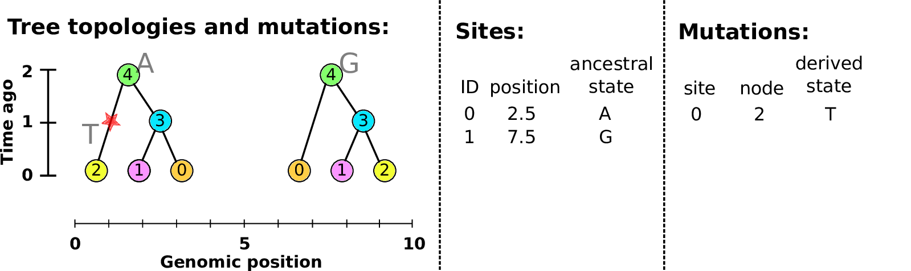

# Outline

## 

people

## Outline of the talk

1. Big picture: adaptation, and genomes
2. Big questions: genomic landscapes
3. Pattern *and* process: tree sequences
4. Simulation: the flexible tool
5. Back to the landscapes

# Adaptation, and genetic variation

## Sickle-cell (HbS) allele frequencies

Human sickle-cell allele (HbS):
(Currat et al 2002)

- Single base substitution
- provide protection against malaria 
  (but deleterious in homozygotes)

## G6PD deficiency allele frequencies

Human G6PD variants:
Howes et al 2013)

- over 130 G6PD deficiency alleles; 
    34 variants at high frequency
- provide protection against malaria 
    but increases risk of anemia
- Estimated ages 40-400 generations

## A nice story about mice.

- Dark-pigmented mammals and reptiles on volcanic outcrops in the Southwest. (Dice, Benson 1936)
- 'Dark' allele beneficial on outcrops, deleterious elsewhere. 
- MC1R: basis is shared *between species* but not *between populations* (Nachman, Hoekstra)

## Habitat is often patchy.

## mimulus serpentine

# Genomic landscapes

##

## Diversity correlates with recombination rate

:::: {.columns}
:::::::: {.column width=80%}

{width=85%}

::::
:::::::: {.column width=20%}

*Hudson 1994; Cutter & Payseur 2013; Corbett-Detig et al 2015*

::::
::::::::

## The *Mimulus aurantiacus* species complex

::: {.centered}
{ width="60%" }
:::

--------------------------

:::: {.columns}
:::::::: {.column width=80%}

::::
:::::::: {.column width=20%}

{width="250%"}

::::
::::::::

---------------------

:::: {.columns}
:::::::: {.column width=80%}

::::
:::::::: {.column width=20%}

{width="250%"}

::::
::::::::

---------------------

:::: {.columns}
:::::::: {.column width=80%}

::::
:::::::: {.column width=20%}

{width="250%"}

::::
::::::::

---------------------

:::: {.columns}
:::::::: {.column width=80%}

::::
:::::::: {.column width=20%}

{width="250%"}

::::
::::::::

<!--
---------------------

:::: {.columns}
:::::::: {.column width=80%}

::::
:::::::: {.column width=20%}

{width="250%"}

::::
::::::::
-->

---------------------

:::: {.columns}
:::::::: {.column width=80%}

::::
:::::::: {.column width=20%}

{width="250%"}

::::
::::::::

---------------------

:::: {.columns}
:::::::: {.column width=80%}

::::
:::::::: {.column width=20%}

{width="250%"}

::::
::::::::

---------------------

:::: {.columns}
:::::::: {.column width=80%}

::::
:::::::: {.column width=20%}

{width="250%"}

::::
::::::::

----------------------------------

----------------------------------

##

What forces create and maintain these genetic landscapes of diversity?

##

$$
\begin{aligned}
\pi &= \text{ (within-pop diversity) } \\
d_{xy} &= \text{ (between-pop divergence) }
% F_{ST} &= \text{ (relative differentiation) }
\end{aligned}
$$

::: {.centered}

{width=60%}

:::

<!-- section THEORY -->

# Linked selection, in theory

--------------

linked selection

: The indirect effects of selection on genomic locations
  that are *linked* to the sites under selection by a lack of recombination.

::: {.centered}

{.fragment width="40%"}
{.fragment width="40%"}

:::

--------------------

**Linked Selection: a field guide**

*composed of rough sketches*

. . .

*citations: numerous*

0. Neutrality
-------------

0. Neutrality
-------------

1. A "hard" sweep
-----------------

2. A "soft" sweep
-----------------

3. Adaptive introgression
-------------------------

4. Local adaptation with gene flow
-------------------

<!-- [Bierne 2010](https://doi.org/10.1111%2fj.1558-5646.2010.01050.x) -->

5. Background selection
-----------------------

6. Recurrent sweeps
-------------------

7. Recurrent introgression
--------------------------

## Etcetera

8. Recent balanching selection

9. Long-term balancing selection

10. Recurrent local adaptation after a split

11. Recurrent, transient balancing selection

12. All of the above?

<!-- Tree sequences -->

# The tree sequence

## History is a sequence of trees

For a set of sampled chromosomes,
at each position along the genome there is a genealogical tree
that says how they are related.

. . .

----------------------

A **tree sequence** describes this, er, sequence of trees.

---------------

---------------

---------------

-------------

[Kelleher, Etheridge, and McVean](http://journals.plos.org/ploscompbiol/article?id=10.1371/journal.pcbi.1004842) 
introduced the **tree sequence** data structure
for a fast coalescent simulator, [msprime](https://github.com/jeromekelleher/msprime).

- stores sequence *and* genealogical data

- tree differences allow **very** efficient

    * subsetting
    * calculation of allele frequencies in arbitrary cohorts
    * linkage disequilibrium
    * log-time haplotype matching

- tree-based sequence storage closely related to haplotype-matching compression

## Simulated file sizes

::: {.centered}
{width=90%}
:::

from *Kelleher et al 2018, *Inferring the ancestry of everyone"*

<!-- Estimated sizes of files required to store the genetic variation data for a
simulated human-like chromosome (100 megabases) for up to 10 billion haploid
(5 billion diploid) samples. Simulations were run for 10 1 up to 10 7 haplotypes
using msprime [Kelleher et al., 2016], and the sizes of the resulting files plotted
(points). -->

---------------

---------------

##

**What do genotypes tell us about the genealogies?**

## Summaries of genotypes and genealogies

::: {.columns}
:::::: {.column width=47%}

*Genotypes:*

1. For each site,
2. look at who has which alleles,
3. and add a *summary* of these values to our running total.

*Example:*
sequence divergence
counts how many mutations differ between two sequences.

:::
:::::: {.column width=5%}

:::
:::::: {.column width=47%}

<!-- nothing til next slide -->

:::
::::::

## It's fast!

{width=80%}

## Summaries of genotypes and genealogies

::: {.columns}
:::::: {.column width=47%}

*Genotypes:*

1. For each site,
2. look at who has inherited which alleles,
3. and add a *summary* of these values to the running total.

*Example:*
sequence divergence
counts how many mutations differ between two sequences.

:::
:::::: {.column width=5%}

:::
:::::: {.column width=47%}

*Trees:*

1. For each branch,
2. look at who would inherit mutations on that branch,
3. and add the *expected contribution* to the running total.

*Example:*
the mean time to most recent common ancestor between two sequences.

:::
::::::

##

## Math moment: duality

Any set of *sample weights* $w$ and *summary function* $f$
defines both

- a statistic of genotypes, $\text{Site}(f,w)$, and
- a statistic of genealogies, $\text{Branch}(f,w)$.

. . .

With genealogies *fixed*, and averaging only over *mutations* with rate $\mu$,
$$\begin{equation}
    \text{Branch}(f, w) = \frac{1}{\mu} \mathbb{E}\left[ \text{Site}(f, w) \right] .
\end{equation}$$

. . .

Dealing directly with genealogies can
*remove the layer of noise due to mutation*.

## Duality, in 1000 Genomes data

{width=75%}

# Application to demographic inference

## 

##

# Application to genomic simulations

## The main idea

If we *record the tree sequence*
that relates everyone to everyone else,

after the simulation is over we can put neutral mutations down on the trees.

. . .

Since neutral mutations don't affect demography,

this is *equivalent* to having kept track of them throughout.

------------

This means recording the entire genetic history of **everyone** in the population, **ever**.

.  . .

It is *not* clear this is a good idea.

## Tree recording strategy

Every time an individual is born, we must:

::: incremental

1. add each contributing gamete to the Node Table,
2. add entries to the Edge Table
    recording which parental copy each inherited each bit of genome from, and
3. add any new non-neutral mutations to the Mutation Table 
    and (if necessary) their locations to the Site Table.

:::

. . .

::: {.columns}
:::::: {.column width=15%}

{width="100%"}

:::
:::::: {.column width=5%}

:::
:::::: {.column width=75%}

This produces **waaaaay** too much data.

:::
::::::

## ... and, tree sequence recording!

## A 100x speedup:

::: {.centered}
{width=60%}
:::

## What else can you do with the tree sequence?

> - record ancient samples 
> - true ancestry reconstruction 
> - *recapitation*: fast, post-hoc initialization with coalescent simulation 

---------------------

**For example:**

- genome as human chr7 ($1.54 \times 10^8$bp)
- $\approx$ 10,000 diploids
- 500,000 overlapping generations
- continuous, square habitat
- selected mutations at rate $10^{-10}$
- neutral mutations added afterwards

*Runtime:* 8 hours

# Back to Mimulus

## The data

## Simulations

::: {.columns}
::::::: {.column width="70%"}

- $N=10,000$ diploids
- burn-in for $10N$ generations
- population split followed by period sampling, with:
    
    * neutral
    * background selection
    * selection against introgressed alleles

:::
::::::: {.column width="30%"}

:::
:::::::

------------------

------------------

# Wrap-up

##

Thanks!!

# An example tree sequence

## Example: three samples; two trees; two variant sites

## Nodes and edges

Edges 

:   Who inherits from who; only *necessary* for coalescent events.

    Records: interval (left, right); parent node; child node.

Nodes 

:   The ancestors those happen in.

    Records: time ago (of birth); ID (implicit).

-------------------

-------------------

-------------------

-------------------

-------------------

-------------------

-------------------

## Sites and mutations

Mutations

:   When state changes along the tree.

    Records: site it occured at; node it occurred in; derived state.

Sites 

:   Where mutations fall on the genome.

    Records: genomic position; ancestral (root) state; ID (implicit).

------------------

------------------

------------------

------------------

------------------

