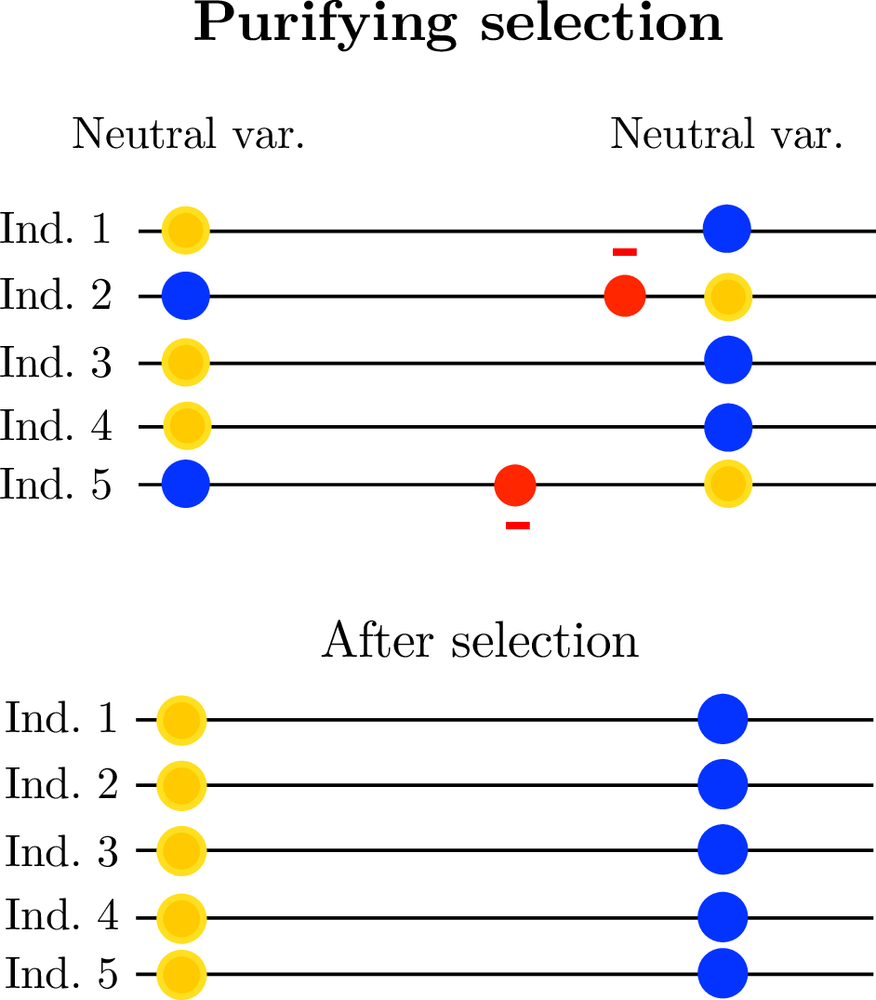
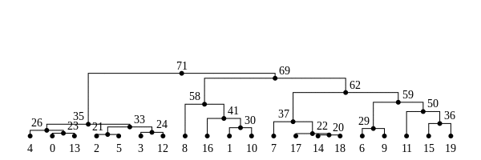
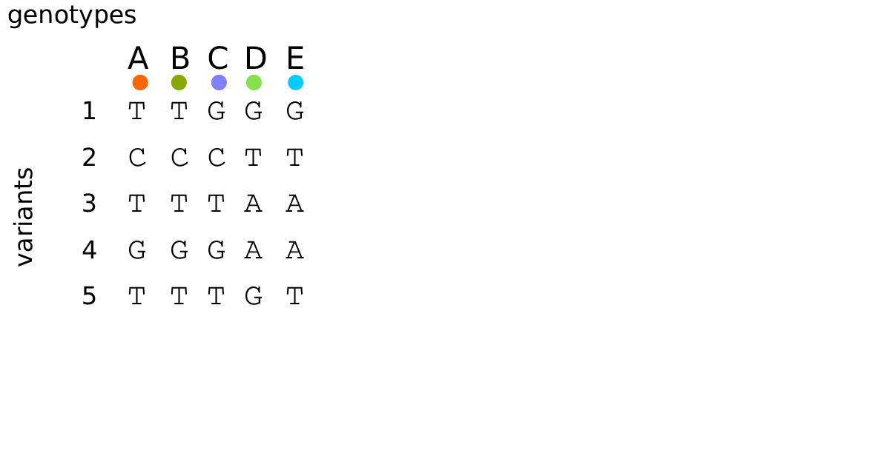

# Outline

## Outline of the talk

1. Big picture
2. Tools
3. Applications

## 

:::: {.columns}
:::::::: {.column width=50%}

Students/postdocs/researchers:

- Matt Lukac
- Murillo Rodrigues 
- Jared Galloway
- Jaime Ashander
- Josh Schiffman
- Erik Lundgren
- Han Li
- Jessica Crisci

Funding:

- NSF DBI
- Sloan foundation
- UO Data Science

::::
:::::::: {.column width=50%}

Other collaborators:

- CJ Battey
- Gideon Bradburd
- Yaniv Brandvain
- Madeline Chase
- Graham Coop
- Bill Cresko
- Matt Dean
- Alison Etheridge
- Ben Haller
- Katja Kasimatis
- Jerome Kelleher
- Andy Kern
- Evan McCartney-Melstad
- Patrick Phillips
- Alisa Sedghifar
- Brad Shaffer
- Sean Stankowski
- Matt Streisfeld
- Anastasia Teterina

::::
::::::::

# Adaptation, and genetic variation

## Sickle-cell (HbS) allele frequencies

Human sickle-cell allele (HbS):
(Currat et al 2002)

- Single base substitution
- provides protection against malaria 
  (but deleterious in homozygotes)

## G6PD deficiency allele frequencies

Human G6PD variants:
Howes et al 2013)

- over 130 G6PD deficiency alleles; 
    34 variants at high frequency
- provide protection against malaria 
    but increases risk of anemia
- Estimated ages 40-400 generations

## 

{width=80%}

- Dark-pigmented mammals and reptiles on volcanic outcrops in the Southwest. (Dice, Benson 1936)
- 'Dark' allele beneficial on outcrops, deleterious elsewhere. 
- MC1R: basis is shared *between species* but not *between populations* (Nachman, Hoekstra)

## 

How generalizable is this?

# Genomic landscapes

##

## Diversity correlates with recombination rate

:::: {.columns}
:::::::: {.column width=80%}

{width=85%}

::::
:::::::: {.column width=20%}

*Hudson 1994; Cutter & Payseur 2013; Corbett-Detig et al 2015*

::::
::::::::

--------------

linked selection

: The indirect effects of selection on genomic locations
  that are *linked* to the sites under selection by a lack of recombination.

::: {.centered}

{.fragment width="40%"}
{.fragment width="40%"}

:::

## The *Mimulus aurantiacus* species complex

:::: {.columns}
:::::::: {.column width=60%}

::::
:::::::: {.column width=40%}

::::::::::: {.caption}
From *Widespread selection and gene flow shape the genomic landscape during a radiation of monkeyflowers*,
Sean Stankowski, Madeline A. Chase, Allison M. Fuiten, Murillo F. Rodrigues, Peter L. Ralph, and Matthew A. Streisfeld;
PLoS Bio 2019.
:::::::::::

::: {.centered}
{width=45%}
{width=45%}
{width=50%}
:::

::::
::::::::

--------------------------

:::: {.columns}
:::::::: {.column width=80%}

::::
:::::::: {.column width=20%}

{width="250%"}

::::
::::::::

---------------------

:::: {.columns}
:::::::: {.column width=80%}

::::
:::::::: {.column width=20%}

{width="250%"}

::::
::::::::

---------------------

:::: {.columns}
:::::::: {.column width=80%}

::::
:::::::: {.column width=20%}

{width="250%"}

::::
::::::::

---------------------

:::: {.columns}
:::::::: {.column width=80%}

::::
:::::::: {.column width=20%}

{width="250%"}

::::
::::::::

<!--
---------------------

:::: {.columns}
:::::::: {.column width=80%}

::::
:::::::: {.column width=20%}

{width="250%"}

::::
::::::::
-->

---------------------

:::: {.columns}
:::::::: {.column width=80%}

::::
:::::::: {.column width=20%}

{width="250%"}

::::
::::::::

---------------------

:::: {.columns}
:::::::: {.column width=80%}

::::
:::::::: {.column width=20%}

{width="250%"}

::::
::::::::

---------------------

:::: {.columns}
:::::::: {.column width=80%}

::::
:::::::: {.column width=20%}

{width="250%"}

::::
::::::::

##

$$
\begin{aligned}
\pi &= \text{ (within-pop genetic distance) } \\
d_{xy} &= \text{ (between-pop genetic distance) }
\end{aligned}
$$

::: {.centered}

{width=60%}

:::

# Some questions

##

<!--
We need better understanding and prediction of how

1. genotype maps to phenotype,
2. natural selection acts on phenotypes,
3. and that affects genetic variation.
-->

How much genetic variation typically underlies traits?

. . .

How important is natural selection in determining genetic diversity?

. . .

How will populations respond to changes in the future?

. . .

To test theories and fit models, we need *simulations* with realistic

1. population sizes,
2. genomes,
3. selective pressures,
4. histories, and
5. geography.

## {data-background-image="figs/oregon_geological_map.png"}

<!-- Tree sequences -->

# The tree sequence

## History is a sequence of trees

For a set of sampled chromosomes,
at each position along the genome there is a genealogical tree
that says how they are related.

. . .

{width=100%}

----------------------

The **tree sequence** is a way to describe this, er, sequence of trees.

---------------

---------------

---------------

-------------

[Kelleher, Etheridge, and McVean](http://journals.plos.org/ploscompbiol/article?id=10.1371/journal.pcbi.1004842) 
introduced the **tree sequence** data structure
for a fast coalescent simulator, [msprime](https://github.com/jeromekelleher/msprime).

- stores sequence *and* genealogical data **very** efficiently

- tree-based sequence storage closely related to haplotype-matching compression

- python/C [`tskit`](https://github.com/tskit-dev/tskit) tools

::: {.floatright}
{width=50%}

:::: {.caption}
jerome kelleher
::::

:::

## File sizes

::: {.centered}
{width=90%}
:::

::: {.caption}
from [Kelleher et al 2018, *Inferring whole-genome histories in large population datasets*](https://www.nature.com/articles/s41588-019-0483-y), Nature Genetics
:::

<!-- Estimated sizes of files required to store the genetic variation data for a
simulated human-like chromosome (100 megabases) for up to 10 billion haploid
(5 billion diploid) samples. Simulations were run for 10 1 up to 10 7 haplotypes
using msprime [Kelleher et al., 2016], and the sizes of the resulting files plotted
(points). -->

## Computation run time

::: {.centered}
{width=70%}
:::

::: {.caption}
from [Ralph, Thornton and Kelleher 2019, *Efficiently summarizing relationships in large samples*](https://www.biorxiv.org/content/10.1101/779132v1?rss=1), bioRxiv
:::

##

**What do genotypes tell us about the genealogies?**

::: {.caption}
also from [Ralph, Thornton and Kelleher 2019, *Efficiently summarizing relationships in large samples*](https://www.biorxiv.org/content/10.1101/779132v1?rss=1), bioRxiv
:::

## Summaries of genotypes and genealogies

::: {.columns}
:::::: {.column width=47%}

*Genotypes:*

1. For each site,
2. look at who has which alleles,
3. and add a *summary* of these values to our running total.

*Example:*
genetic distance
counts how many mutations differ between two sequences.

:::
:::::: {.column width=5%}

:::
:::::: {.column width=47%}

<!-- nothing til next slide -->

:::
::::::

## Summaries of genotypes and genealogies

::: {.columns}
:::::: {.column width=47%}

*Genotypes:*

1. For each site,
2. look at who has inherited which alleles,
3. and add a *summary* of these values to the running total.

*Example:*
sequence divergence
counts how many mutations differ between two sequences.

:::
:::::: {.column width=5%}

:::
:::::: {.column width=47%}

*Trees:*

1. For each branch,
2. look at who would inherit mutations on that branch,
3. and add the *expected contribution* to the running total.

*Example:*
the mean time to most recent common ancestor between two sequences.

:::
::::::

##

## Duality

Any set of *sample weights* $w$ and *summary function* $f$
defines both

- a statistic of genotypes, $\text{Site}(f,w)$, and
- a statistic of genealogies, $\text{Branch}(f,w)$.

. . .

With genealogies *fixed*, and averaging only over *mutations* with rate $\mu$,
$$\begin{equation}
    \text{Branch}(f, w) = \frac{1}{\mu} \E\left[ \text{Site}(f, w) \right] .
\end{equation}$$

. . .

Dealing directly with genealogies can
*remove the layer of noise due to mutation*:
$$\begin{equation}
    \frac{1}{\mu^2} \var\left[\text{Site}(f,w)\right]
    =
    \var\left[\text{Branch}(f,w)\right]
    +
    \frac{1}{n}
    \E\left[\text{Branch}(f^2,w)\right]
\end{equation}$$

## 

:::: {.columns}
:::::::: {.column width=60%}

{width=100%}

:::
:::::::: {.column width=40%}

Duality, on 1000 Genomes data? Not quite...

- variation in mutation rate?
- biased gene conversion?
- selection?
- inference artifacts?

::: {.caption}
*Tree sequence from [Speidel et al 2019](https://www.nature.com/articles/s41588-019-0484-x).*
:::

:::
::::::::

# Application to demographic inference

## 

:::: {.columns}
:::::::: {.column width=50%}

{width=80%}

::::
:::::::: {.column width=50%}

Erik Lundgren: "Isolation By Coalescence"

- fits a discrete random walk model to *lineage movement*
- genetic distance $\approx$ mean *coalescence time*

::: {.caption}
From [Lundgren and Ralph, 2019, *Are populations like a circuit?*](https://onlinelibrary.wiley.com/doi/abs/10.1111/1755-0998.13035)
:::

::::
::::::::

## 

:::: {.columns}
:::::::: {.column width=70%}

{width=100%}

:::
:::::::: {.column width=30%}

*Populus trichocarpa* and *P. balsamifera* data from
[Moreno Geraldes et al 2014](https://onlinelibrary.wiley.com/doi/abs/10.1111/evo.12497)

- glacial refugia
- postglacial expansion

:::
::::::::

# Application to genomic simulations

## The main idea

If we *record the tree sequence*
that relates everyone to everyone else,

after the simulation is over we can put neutral mutations down on the trees.

. . .

Since neutral mutations don't affect demography,

this is *equivalent* to having kept track of them throughout.

. . .

:::: {.columns}
:::::::: {.column width=50%}

:::: {.caption}
From 
Kelleher, Thornton, Ashander, and Ralph 2018,
[Efficient pedigree recording for fast population genetics simulation](https://journals.plos.org/ploscompbiol/article?id=10.1371/journal.pcbi.1006581).

and Haller, Galloway, Kelleher, Messer, and Ralph 2018,
[*Tree‐sequence recording in SLiM opens new horizons for forward‐time simulation of whole genomes*](https://onlinelibrary.wiley.com/doi/abs/10.1111/1755-0998.12968)
:::

::::
:::::::: {.column width=50%}

::: {.floatright}
{width=35%}
{width=30%}
:::

::::
::::::::

------------

This means recording the entire genetic history of **everyone** in the population, **ever**.

.  . .

It is *not* clear this is a good idea.

. . .

But, with a few tricks...

## A 100x speedup!

<!--
{data-background-image="figs/slim_timing_no_msprime.png" data-background-size=40% data-background-position=left}
-->

::: {.floatright}
{width=70%}
:::

## What else can you do with tree sequences?

> - record ancient samples 
> - true ancestry reconstruction 
> - *recapitation*: fast, post-hoc initialization with coalescent simulation 

---------------------

**For example:**

- genome as human chr7 ($1.54 \times 10^8$bp)
- $\approx$ 10,000 diploids
- 500,000 overlapping generations
- continuous, square habitat
- selected mutations at rate $10^{-10}$
- neutral mutations added afterwards

*Runtime:* 8 hours

# Back to Mimulus

## The data

:::: {.columns}
:::::::: {.column width=80%}

::::
:::::::: {.column width=20%}

{width="250%"}

::::
::::::::

## Simulations

::: {.columns}
::::::: {.column width="70%"}

- $N=10,000$ diploids
- burn-in for $10N$ generations
- population split, with either:
    
    * neutral
    * background selection
    * selection against introgressed alleles

:::
::::::: {.column width="30%"}

:::: {.flushright}

::::: {.caption}
Murillo Rodrigues
:::::
::::

:::
:::::::

------------------

::::: {.flushright}

::::::::::: {.caption}
From *Widespread selection and gene flow shape the genomic landscape during a radiation of monkeyflowers*,
Sean Stankowski, Madeline A. Chase, Allison M. Fuiten, Murillo F. Rodrigues, Peter L. Ralph, and Matthew A. Streisfeld;
PLoS Bio 2019.
:::::::::::
:::::

# Wrap-up

##

We need better understanding and prediction of how

1. genotype maps to phenotype,
2. natural selection acts on phenotypes,
3. and that affects genetic variation.

To test theories and fit models, we need *simulations* with realistic

1. population sizes,
2. genomes,
3. selective pressures,
4. histories, and
5. geography.

## {data-background-image="figs/guillemots_thanks.png" data-background-position=center data-background-size=50%}

# An example tree sequence

## Example: three samples; two trees; two variant sites

## Nodes and edges

Edges 

:   Who inherits from who; only *necessary* for coalescent events.

    Records: interval (left, right); parent node; child node.

Nodes 

:   The ancestors those happen in.

    Records: time ago (of birth); ID (implicit).

-------------------

-------------------

-------------------

-------------------

-------------------

-------------------

-------------------

## Sites and mutations

Mutations

:   When state changes along the tree.

    Records: site it occured at; node it occurred in; derived state.

Sites 

:   Where mutations fall on the genome.

    Records: genomic position; ancestral (root) state; ID (implicit).

------------------

------------------

------------------

------------------

------------------

